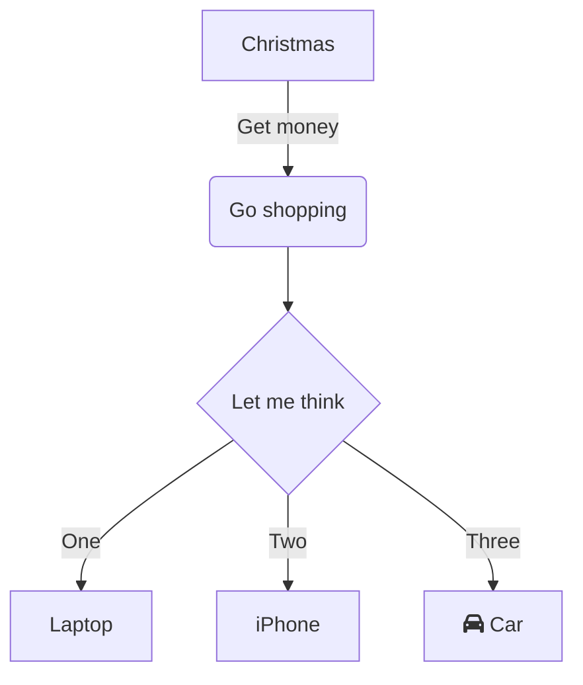

# はじめてのAstroマークダウン

これはAstroのContent Collectionsを使ったサンプルの記事です。

## マークダウンの基本機能

### 見出し

見出しは`#`を使って作成できます。

### リスト

- 項目1
- 項目2
- 項目3

### コードブロック

```javascript
const message = "Hello, Astro!";
console.log(message);
```

### Mermaid図



### 引用

> これは引用文のサンプルです。マークダウンでは`>`を使って引用を表現できます。

## まとめ

Astroのマークダウン機能を使うことで、静的なコンテンツを簡単に管理できます。